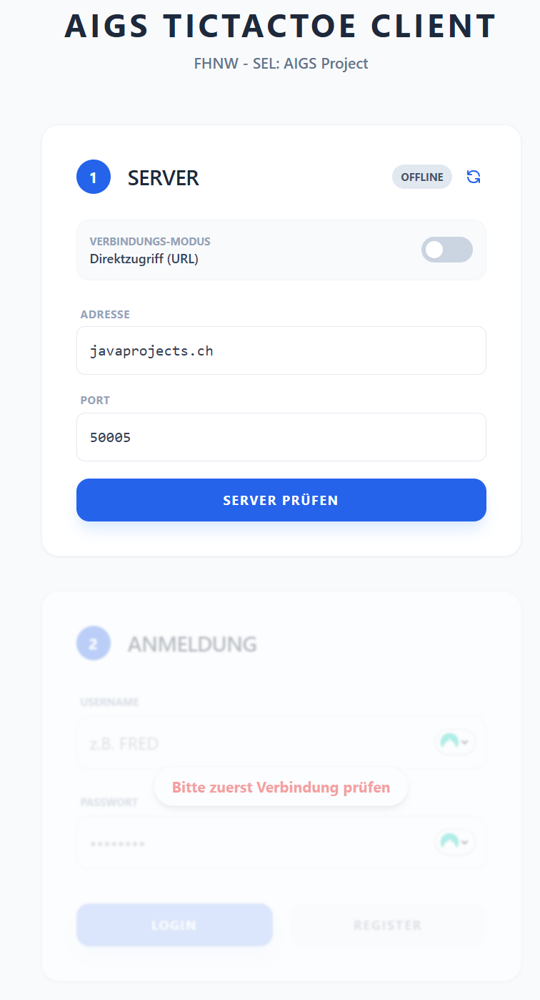
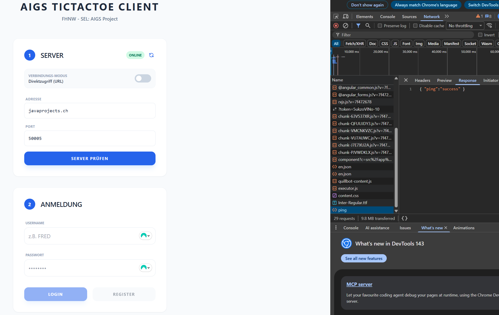
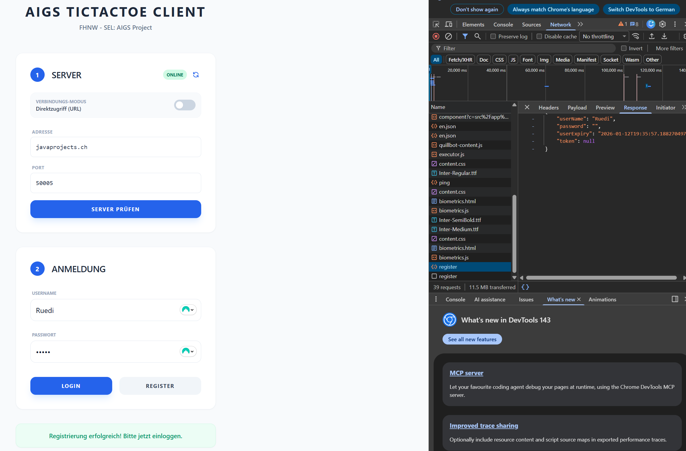
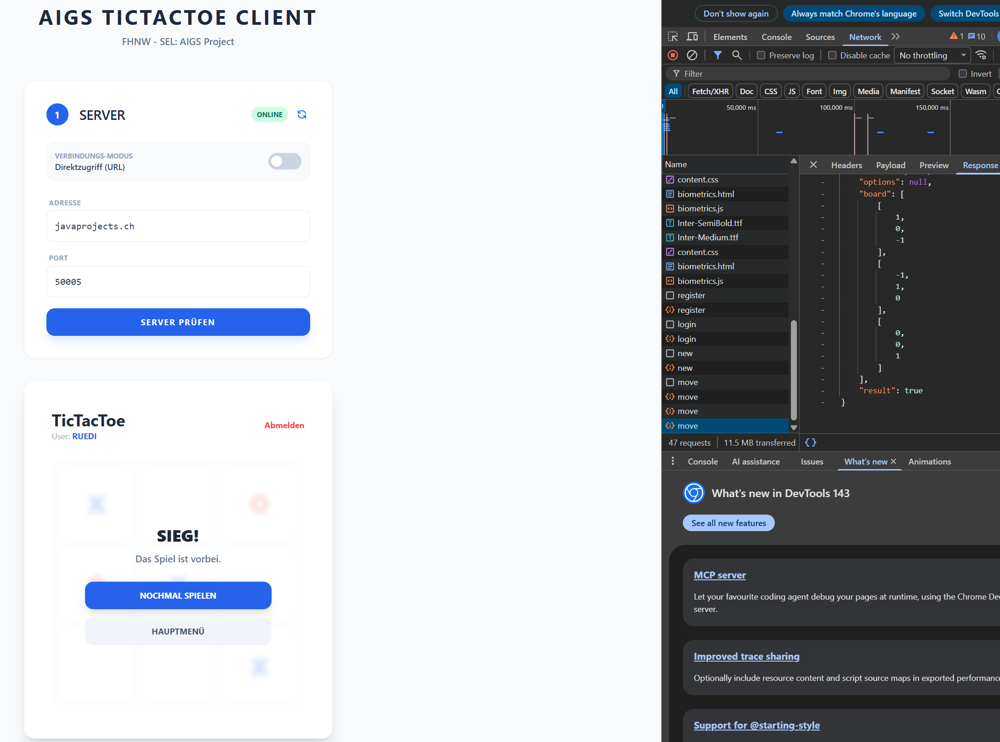
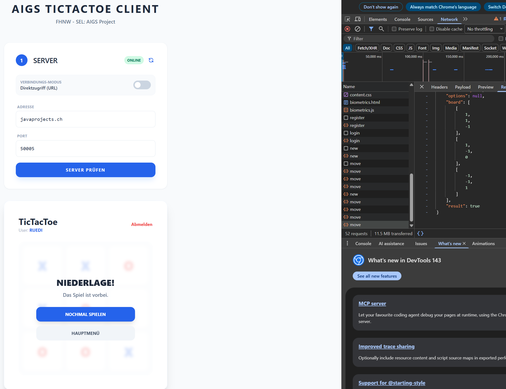

# Architektur- und Projektdokumentation
## AIGS Angular Client (TicTacToe)

---

## 1. Einleitung

Diese Dokumentation beschreibt den Aufbau, die Architektur sowie die technischen Konzepte des **AIGS Angular Clients**. 
Ziel des Projekts ist die Umsetzung eines webbasierten Clients für den **AIGS**, der es Benutzern ermöglicht, 
sich zu registrieren, einzuloggen und das Spiel **TicTacToe** gegen eine serverseitige KI zu spielen.

---

## 2. Projektübersicht

Der Angular Client fungiert als Frontend-Anwendung, welche über eine REST-Schnittstelle mit einem Java/SpringBoot-Backend kommuniziert.

### 2.1 Zielsetzung

- Umsetzung eines webbasierten Spiel-Clients für TicTacToe
- Saubere Trennung von Darstellung, Logik und Datenhaltung
- Reaktive Aktualisierung der Benutzeroberfläche
- Nutzung moderner Angular-Konzepte (Signals, Standalone Components)

### 2.2 Technologiestack

- **Frontend:** Angular (v19+ / CLI 21)
- **Sprache:** TypeScript
- **UI:** HTML, Tailwind CSS
- **Kommunikation:** REST (JSON über HTTP)
- **Backend:** AIGS Spring Boot Server (getestet mit lokaler als auch javaprojects.ch Instanz)

---

## 3. Installation und Ausführung

1. Repository klonen `github.com`
2. Abhängigkeiten installieren (`npm install`)
3. Backend starten (Java Spring Boot Server) oder `javaprojects.ch:50005` verwenden
4. Frontend starten (`ng serve`)
5. Aufruf im Browser unter `http://localhost:4200`

### 3.1 Login / Registrierung
Für das Login bzw. die Registrierung muss ein Username von min. 3 Zeichen und ein Passwort von mindestens 4 Zeichen gewählt werden. Ansonsten kann es in der `app.ts`-Datei verändert werden:
```typescript
 authForm = new FormGroup({
  userName: new FormControl('', {
    nonNullable: true,
    validators: [Validators.required, Validators.minLength(3)]
  }),
  password: new FormControl('', {
    nonNullable: true,
    validators: [Validators.required, Validators.minLength(4)]
  })
});

```

--- 

## 4. Architekturkonzept

### 4.1 Grundprinzip: Separation of Concerns

Die Anwendung folgt konsequent dem Prinzip der *Trennung von Verantwortlichkeiten*. Die einzelnen Aufgabenbereiche sind klar voneinander abgegrenzt:

- **Model Layer:** Definition der Datenstrukturen
- **Service Layer:** Geschäftslogik und Serverkommunikation
- **Component Layer:** UI-Steuerung und Darstellung

Dieses Architekturprinzip erhöht die Wartbarkeit, Testbarkeit und Erweiterbarkeit der Anwendung.

### 4.2 Vergleich: Angular vs. JavaFX (MVC)

| Feature | JavaFX (Referenz) | Angular (Dein Client) | Beschreibung |
| :---- | :---- | :---- | :---- |
| **Model** | TTT\_Model.java | GameService | Zentrale Datenhaltung und Logik. |
| **View** | FXML / GameBoard.java | app.html (Template) | Deklarative Definition der UI. |
| **Controller** | GameController.java | app.ts (Klasse) | Bindeglied zwischen View und Service. |

Im Gegensatz zum klassischen MVC-Ansatz von JavaFX kombiniert Angular **View und Controller** in einer sogenannten *Component*, während Services die Rolle globaler Models übernehmen.

---

## 5. Model Layer

Der Model Layer besteht aus TypeScript-Interfaces (
`*.model.ts`), die die Struktur der Daten definieren, welche zwischen Client und Server ausgetauscht werden.

### 5.1 Aufgaben des Model Layers

- Definition der erwarteten JSON-Strukturen
- Typensicherheit während der Entwicklung
- Klare Verträge zwischen Frontend und Backend

### 5.2 Beispielhafte Modelle

- **AuthRequest / AuthResponse**: Daten für Login und Registrierung
- **GameResponse**: Aktueller Spielzustand (Spielfeld, Spieler, Status)
- **MoveRequest**: Daten eines Spielzugs (Token, Zeile, Spalte)

---

## 6. Service Layer

Der Service Layer kapselt die gesamte Geschäftslogik sowie die Kommunikation mit dem Backend.

### 6.1 Eigenschaften von Services

- Werden als **Singletons** innerhalb der Angular-Anwendung verwendet
- Können per **Dependency Injection** in Components eingebunden werden
- Verwalten globale Zustände mittels *Angular Signals*

### 6.2 AuthService

Der `AuthService` ist für das Session-Management zuständig:

* **Token-Handling:** Speichert das vom Server gelieferte token in einem Signal. Dies ist essenziell, da das Token für jeden Spielzug (`/game/move`) benötigt wird.
* **Status:** Verwaltet den `isLoggedIn` Status reaktiv.

Das Token wird in einem Signal gespeichert und steht damit reaktiv allen abhängigen Komponenten zur Verfügung.

### 6.3 GameService

Der `GameService` verwaltet den kompletten Spielzustand:

* **Single Source of Truth:** Hält das `gameState` Signal (Typ `GameResponse`).
* **Kommunikation:** Kapselt die Endpunkte `/game/new` und `/game/move`.
* **Reset-Logik:** Ermöglicht durch `resetGame()` (Setzen des Zustands auf null) die Rückkehr zur Spielkonfiguration.

---

## 7. Reaktivität mit Angular Signals

### 7.1 Signals

Signals sind reaktive Container für Zustände. Sobald sich ihr Wert ändert, werden alle abhängigen Teile der Anwendung automatisch aktualisiert.

**Vergleich zu JavaFX:**

- Angular Signals ↔ JavaFX Properties (z. B. `SimpleStringProperty`)
- Kein manuelles Registrieren oder Entfernen von Listenern notwendig

### 7.2 Computed Signals

Computed Signals sind abgeleitete Zustände, die automatisch neu berechnet werden, wenn sich ihre Abhängigkeiten ändern.

Beispiel:
- Das Spielfeld (`board`) wird aus dem `gameState` berechnet
- Jede Änderung am Spielzustand führt automatisch zu einer Aktualisierung der UI

---

## 8. Component Layer (UI)

Die Component (`app.ts`) bildet die Schnittstelle zwischen Benutzeroberfläche (`app.html`) und Services (`*.service.ts`).

### 8.1 Aufgaben der Component

- Reaktion auf Benutzerinteraktionen
- Aufruf der entsprechenden Service-Methoden
- Aufbereitung der Daten für die Darstellung

### 8.2 Template (HTML)

Die Benutzeroberfläche ist **deklarativ** aufgebaut:

- Darstellung des Spielfelds über ein CSS-Grid (3x3)
- Nutzung von Angular Control Flow (`@for`, `@if`)
- Direktes Binding an Signals

Im Gegensatz zu imperativen UI-Ansätzen wird nicht explizit beschrieben *wie* die UI aktualisiert wird, sondern *wie sie aussehen soll*, basierend auf dem aktuellen Zustand.

### 8.3 Beispiel (Board)

```typescript
@for (rowIdx of \[0, 1, 2\]; track rowIdx) {  
  @for (colIdx of \[0, 1, 2\]; track colIdx) {  
    \<button (click)="onCellClick(rowIdx, colIdx)"   
            \[disabled\]="board()\[rowIdx\]\[colIdx\] \!== 0 || ..."\>  
      {{ board()\[rowIdx\]\[colIdx\] \=== 1 ? 'X' : (board()\[rowIdx\]\[colIdx\] \=== \-1 ? 'O' : '') }}  
    \</button\>  
  }  
}
```
* **Vergleich zu JavaFX:** In `GameBoard.java` müssen Buttons manuell in einer Schleife erstellt und 
per `setText()` aktualisiert werden. In Angular beschreiben wir nur das Muster; 
die Aktualisierung erfolgt automatisch durch das Daten-Binding an das `board()` Signal.
---

## 9. Datenfluss eines Spielzugs

Der Ablauf eines Spielzugs erfolgt in klar definierten Schritten:

1. **Interaktion:** Benutzer klickt auf eine Zelle im Grid.
2. **Validierung:** Komponente prüft `board()\[row\]\[col\] \=== 0` (Feld frei?) und ob das Spiel bereits beendet ist.
3. **Service-Call:** `gameService.makeMove()` sendet Koordinaten als Strings (`"0"`, `"1"`, `"2"`) an das Backend.
4. **Backend:** Verarbeitet den Zug (User \= 1, Server \= \-1) und sendet das neue Board zurück.
5. **Reaktives Update:** Der Service setzt das Signal `\_gameState.set(res)`.
6. **Auto-Render:** Das Template erkennt die Änderung des Signals und zeichnet das "X" und das darauf folgende "O" des Servers sofort neu.

Es ist keine manuelle DOM-Manipulation erforderlich.

---

## 10. Serverkommunikation & CORS

### 10.1 Problemstellung

Während der Entwicklung laufen Frontend und Backend auf unterschiedlichen Ports. Aufgrund der *Same-Origin-Policy* blockieren Browser solche Anfragen standardmäßig.

### 10.2 Lösung: Entwicklungs-Proxy

Ein Angular-Proxy leitet API-Anfragen intern an den Backend-Server weiter:

- Frontend nutzt `/api/*`
- Proxy leitet Anfragen an den konfigurierten Backend-Port weiter
- Keine CORS-Fehler während der Entwicklung

---

## 11. Fazit

Der AIGS Angular Client demonstriert den erfolgreichen Transfer einer klassischen JavaFX-Architektur in eine moderne Web-Umgebung. Durch den Einsatz von Signals wird ein hocheffizientes, reaktives System geschaffen, das die Komplexität des State-Managements im Vergleich zum Referenzprojekt deutlich reduziert.

## 12. Demo Screenshots
### 12.1 Connection 


### 12.2 Connection Success 



### 12.3 Register Success



### 12.4 Login Success


### 12.5 Player-Win



### 12.6 Player-Lose

